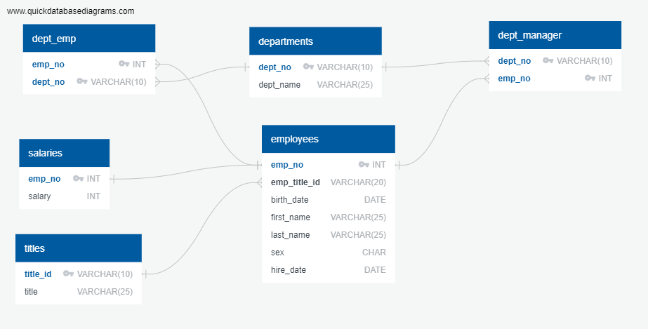
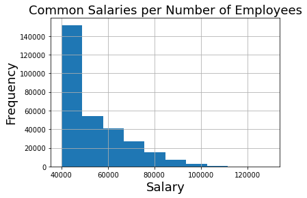
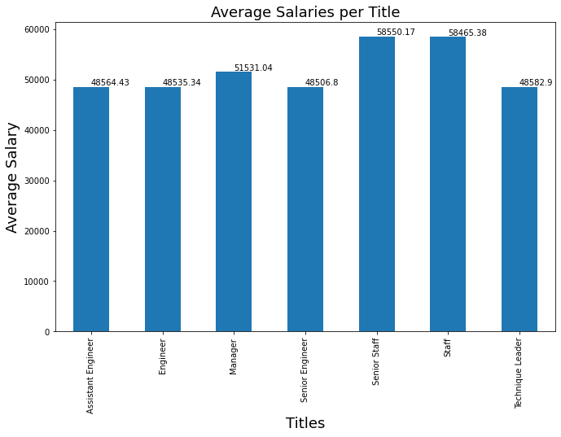
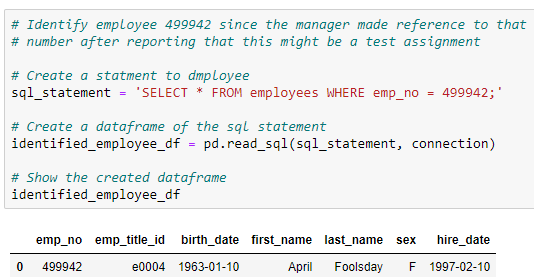

# sql-challenge

# Background
[Project Details](project_instructions_readme.md)

# Project Information
Inside the EmployeeSQL directory there are the following:

    * data directory - Contains the csv files for import into EmployeeSQL

    * ERA_Setup.xlsx - Contains the information pulled from the CSV files to utilze when creating tables
    * ERA_Setup.txt - Contains the information used to create the ERD Diagram
    * ERA_Diagram.png - A ERA Diagram of EmployeeSQL

    * EmployeeSQL_Creation.sql - contains the SQL to create the tables in the EmployeeSQL database

    * EmployeeSQL_Query.sql - contains the SQL to run the requseted queries on EmployeeSQL database

    * EmployeeSQL_Bonus_Analysis.ipynb - A Jupyter Notebook to perform the bonus analysis using SQLAlchemy 
    * config.py - This file is necessary to execute EmployeeSQL Bonus Analysis.ipynb and must be created using the correct values instead of "".

        user_name = ""
        password = ""
        port_no = ""
        db_name = "EmployeeSQL"
# Setup Information
In order to run the different portions of this project,  the following needs to be done.
* Create config.py with the user, password, and port for pgAdmin4 and use EmployeeSQL as the database name
* Create EmployeeSQL database using pgAdmin4
* Open EmployeeSQL_Creation.sql and execute
* Manually import the data from the data directory in the following order (has headers and deliminted by ,):
    * departments
    * titles
    * employees
    * dept_emp
    * dept_manager
    * salaries

* Open EmployeeSQL_Query.sql and run each query
* Open the Jupyter Notebook EmployeeSQL_Bonus_Analysis.ipynb and execute Restart & Run All

# ERD Diagram

# Bonus Analysis Observations
## The following is the common salaries analysis

### Observations
The number of employees in the smaller salary ranges are greater than the number employees in the larger salary range. That is realistic.
But according to statista.com HP did not reach over 300,000 until 2008. Additionally HP Wikipedia mentioned that there were 85,000 employees in 1985. Therefore the total salary records of 300,024 in the 80s and 90s does not seem realistic.

## The following is the average salary per title analysis

### Observations
There are some things that do not make sense when reviewing this result. Assistant Engineer, Engineer, and Senior Engineer have average salaries that are almost the same. As well Staff and Senior Staff have around the same average salary which should not be the case.

# The indentification of employee 499942

# Observations
Given the name of the employee is April Foolsday, the reference to this employee seems to confirm that this assignement was a test.
